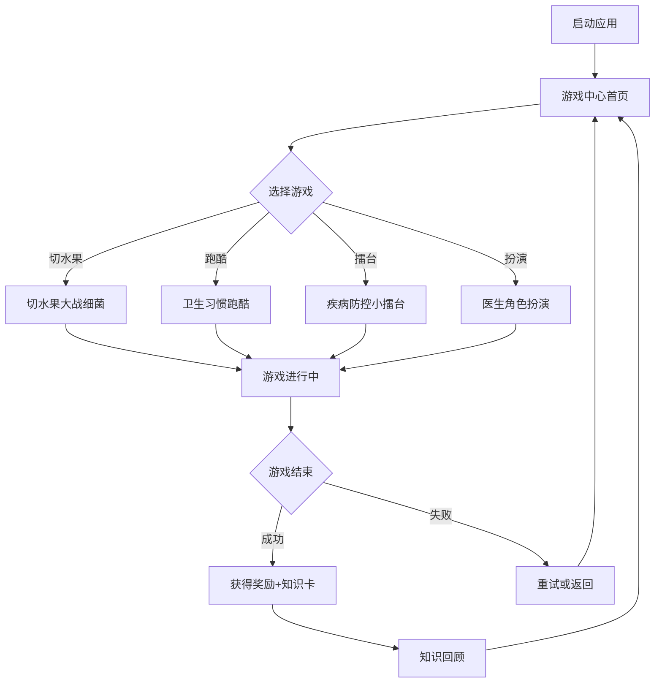

# 儿童传染病防控科普游戏 - 产品需求文档

## 1. 产品概述

**项目名称**: 健康小卫士 - 儿童传染病防控科普游戏

**一句话简介**: 一款融合切水果、跑酷、擂台等趣味小游戏的儿童健康教育平台，通过游戏互动让3-12岁儿童轻松学习传染病防控知识。

**核心价值**: 
- 将枯燥的医学知识转化为生动有趣的游戏元素
- 培养儿童良好的卫生习惯和健康意识
- 提供安全、无广告的绿色游戏环境

**目标用户**: 3-12岁儿童及其家长

## 2. 核心功能

### 2.1 游戏中心首页
- 可爱的卡通欢迎界面
- 游戏选择大转盘/地图导航
- 进度展示（已获得勋章、已解锁游戏）
- 知识科普入口

### 2.2 迷你游戏列表

#### 2.2.1 切水果大战细菌
**游戏机制**: 
- 屏幕上掉落各种水果和细菌
- 玩家通过滑动/点击切割水果获得分数
- 切割到细菌会扣分并触发健康知识提示
- 正确切割特定水果会触发"防疫知识卡"奖励

**科普知识点**:
- 七步洗手法的正确顺序
- 什么情况下需要佩戴口罩
- 细菌与病毒的区别

#### 2.2.2 卫生习惯跑酷
**游戏机制**:
- 角色在跑道上自动前进
- 玩家控制跳跃、滑行躲避障碍物
- 正确完成卫生动作（如正确洗手动作）获得道具
- 收集"健康能量"解锁关卡

**科普知识点**:
- 正确刷牙的方法
- 咳嗽打喷嚏的礼仪
- 饭前便后要洗手的重要性

#### 2.2.3 疾病防控小擂台
**游戏机制**:
- 回合制问答对战
- 匹配题目（如：以下哪种行为可以预防感冒？）
- 正确答案获得攻击机会
- 融入角色扮演和策略元素

**科普知识点**:
- 疫苗接种的重要性
- 常见传染病的传播途径
- 如何增强免疫力

#### 2.2.4 医生角色扮演
**游戏机制**:
- 模拟小医生场景
- 为虚拟患者（玩偶）检查身体
- 学习听诊器、体温计等医疗器械的使用
- 根据症状选择正确的护理方式

**科普知识点**:
- 为什么要接种疫苗
- 生病时为什么要多喝水休息
- 什么时候需要看医生

### 2.3 知识百科
- 图文并茂的健康知识卡片
- 动画演示正确洗手、戴口罩等方法
- 互动测验检验学习成果
- 家长指导专区

### 2.4 奖励系统
- 游戏积分和虚拟货币
- 收集健康勋章
- 解锁新角色和游戏场景
- 成就排行榜

## 3. 用户流程

### 3.1 主流程
```
启动游戏 → 首页选择游戏 → 游玩 → 获得积分和知识卡 → 重复挑战或选择新游戏
```

### 3.2 详细流程图


## 4. 界面设计规范

### 4.1 设计风格
**整体风格**: 可爱卡通风格，明亮活泼，适合儿童

**色彩方案**:
- 主色调: 明亮蓝 #4FC3F7 (信任、健康)
- 辅助色: 活力橙 #FFB74D (能量、快乐)
- 强调色: 清新绿 #81C784 (健康、成长)
- 危险警示: 柔和红 #EF5350 (警示但不过于恐怖)
- 背景色: 浅米白 #FFF8E1 (温馨、护眼)

**字体规范**:
- 主标题: 圆体卡通字体 (如 ZCOOL KuaiLe 或同系列)
- 正文字体: 圆润易读的无衬线字体
- 字号: 较大，方便儿童阅读

**按钮样式**:
- 大圆角按钮 (border-radius: 20-30px)
- 立体感按钮带阴影
- 按钮尺寸至少 60x60px 便于点击

**图标风格**:
- 圆润可爱的卡通图标
- Emoji表情辅助
- 无尖锐边角

### 4.2 页面设计

#### 首页
- 顶部: Logo + 积分/勋章显示
- 中间: 大型游戏选择转盘/地图
- 底部: 知识百科入口 + 设置按钮
- 背景: 可爱的医院/健康主题插画

#### 游戏页面
- 顶部: 返回按钮 + 当前分数 + 进度条
- 中间: 游戏主画面
- 底部: 暂停按钮 + 提示按钮
- 反馈: 动画效果 + 音效提示

#### 结果页面
- 分数展示 + 星级评定
- 获得的知识卡片展示
- 分享按钮 + 再玩一次按钮

### 4.3 响应式设计
- 优先支持移动端触摸操作
- 平板横屏模式优化
- 桌面端鼠标操作适配
- 所有交互元素最小 44x44px

### 4.4 动画效果
- 页面切换: 平滑滑动过渡
- 按钮点击: 缩放反馈动画
- 游戏元素: 弹性动画
- 奖励获得: 星星闪烁+飘落效果
- 提示卡片: 弹出+淡入动画

## 5. 数据存储

### 5.1 本地存储
- 用户游戏进度
- 累计积分和勋章
- 已解锁内容
- 设置偏好

### 5.2 游戏配置
- 关卡难度配置
- 知识题库
- 道具和奖励配置

## 6. 性能要求

- 首屏加载时间 < 3秒
- 游戏帧率 60fps
- 支持离线缓存基础内容
- 内存占用 < 200MB
