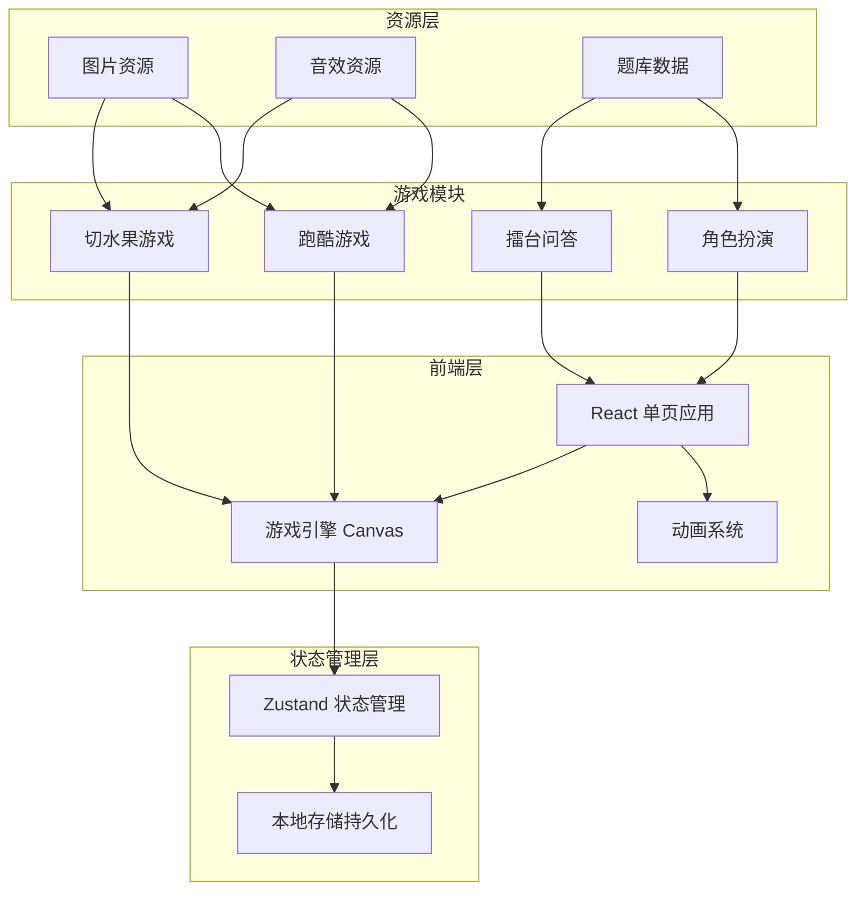

# 儿童传染病防控科普游戏 - 技术架构文档

## 1. 架构设计



## 2. 技术选型

### 2.1 核心技术栈
- **前端框架**: React 18 + TypeScript
- **构建工具**: Vite
- **样式方案**: Tailwind CSS
- **游戏引擎**: 原生 Canvas API + requestAnimationFrame
- **状态管理**: Zustand (轻量级)
- **本地存储**: localStorage
- **动画库**: Framer Motion
- **图标**: Heroicons + 自定义 SVG

### 2.2 项目初始化
```bash
npm create vite@latest health-guardian -- --template react-ts
cd health-guardian
npm install zustand framer-motion
npm install -D tailwindcss postcss autoprefixer
npx tailwindcss init -p
```

## 3. 路由设计

| 路由路径 | 页面名称 | 功能描述 |
|---------|---------|---------|
| / | 首页/游戏中心 | 游戏选择界面 |
| /game/fruit-slice | 切水果游戏 | 切水果大战细菌 |
| /game/run | 跑酷游戏 | 卫生习惯跑酷 |
| /game/quiz | 擂台问答 | 疾病防控小擂台 |
| /game/doctor | 医生扮演 | 角色扮演游戏 |
| /encyclopedia | 知识百科 | 健康知识卡片 |
| /profile | 个人中心 | 积分、勋章展示 |

## 4. 数据模型

### 4.1 用户数据
```typescript
interface UserData {
  id: string;
  nickname: string;
  totalScore: number;
  level: number;
  badges: Badge[];
  unlockedGames: string[];
  knowledgeCards: KnowledgeCard[];
}

interface Badge {
  id: string;
  name: string;
  icon: string;
  unlockedAt?: Date;
}

interface KnowledgeCard {
  id: string;
  title: string;
  content: string;
  image?: string;
  unlockedAt: Date;
}
```

### 4.2 游戏状态
```typescript
interface GameState {
  isPlaying: boolean;
  score: number;
  lives: number;
  currentLevel: number;
  questionIndex?: number;
}
```

### 4.3 题库结构
```typescript
interface Question {
  id: string;
  category: 'hygiene' | 'vaccine' | 'disease' | 'immunity';
  difficulty: 'easy' | 'medium' | 'hard';
  question: string;
  options: string[];
  correctAnswer: number;
  explanation: string;
}
```

## 5. 组件结构

```
src/
├── components/
│   ├── common/
│   │   ├── Button.tsx
│   │   ├── Modal.tsx
│   │   ├── Card.tsx
│   │   └── Loading.tsx
│   ├── game/
│   │   ├── GameCanvas.tsx
│   │   ├── Fruit.tsx
│   │   ├── Bacteria.tsx
│   │   ├── Runner.tsx
│   │   └── Obstacle.tsx
│   ├── knowledge/
│   │   ├── KnowledgeCard.tsx
│   │   └── QuizCard.tsx
│   └── layout/
│       ├── Header.tsx
│       └── GameMap.tsx
├── pages/
│   ├── Home.tsx
│   ├── FruitSliceGame.tsx
│   ├── RunGame.tsx
│   ├── QuizGame.tsx
│   ├── DoctorGame.tsx
│   ├── Encyclopedia.tsx
│   └── Profile.tsx
├── stores/
│   └── gameStore.ts
├── hooks/
│   ├── useGameLoop.ts
│   └── useLocalStorage.ts
├── data/
│   └── questions.ts
├── utils/
│   └── gameUtils.ts
└── styles/
    └── index.css
```

## 6. 游戏引擎架构

### 6.1 Canvas 游戏循环
```typescript
const gameLoop = () => {
  update();  // 更新游戏状态
  render();  // 渲染画面
  requestAnimationFrame(gameLoop);
};
```

### 6.2 碰撞检测
- 矩形碰撞检测用于水果和刀痕
- 圆形碰撞检测用于角色和障碍物

### 6.3 触控处理
- Touch Start/Move/End 事件监听
- 滑动轨迹记录
- 有效切割判定

## 7. 性能优化策略

1. **Canvas 优化**
   - 使用离屏 Canvas 预渲染静态元素
   - 对象池复用游戏对象
   - requestAnimationFrame 精确控制帧率

2. **资源加载**
   - 图片懒加载
   - 关键资源预加载
   - 压缩资源文件

3. **内存管理**
   - 及时释放未使用的游戏对象
   - 避免内存泄漏

## 8. 响应式适配

### 8.1 断点设计
- 移动端: < 768px
- 平板端: 768px - 1024px
- 桌面端: > 1024px

### 8.2 触摸优化
- 所有可点击元素 >= 44x44px
- 游戏区域自适应屏幕尺寸
- 支持横屏和竖屏模式

## 9. 无障碍设计

- 颜色对比度符合 WCAG 标准
- 支持键盘操作
- 游戏配有文字提示
- 重要信息有音频辅助
